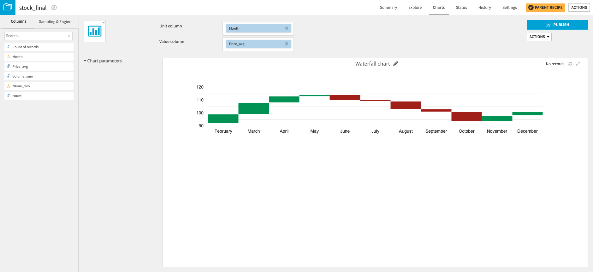

# Waterfall chart

This Dataiku DSS plugin adds a custom chart: the waterfall chart.

Waterfall charts are useful to visualize the cumulative effect of sequential events, introducing either positive or negative values.

This chart is based on the [Google Charts library](https://developers.google.com/chart/) and requires internet access to render on your datasets.

## How to use this plugin

The **Unit column** corresponds to the sequential (for instance the Time) column.
The **Value column** corresponds to the variable (for instance Price) that evolves with the sequential variable.

## License
This project is licensed under the Apache Software License.

