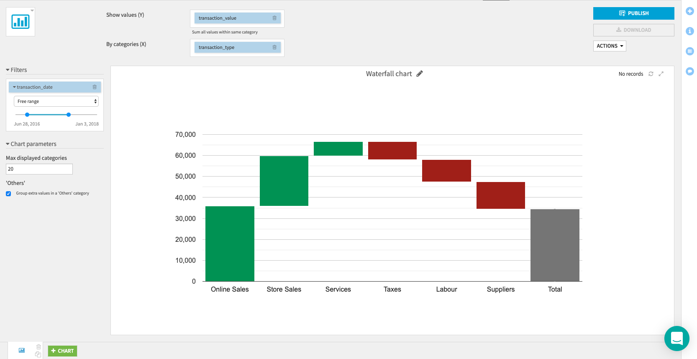

# Waterfall chart

This Dataiku DSS plugin adds a custom chart: the waterfall chart.

Waterfall charts are useful to visualize the cumulative effect of different events, introducing either positive or negative values. They are quite similar to categorical histogram using cumulative values.

This chart is based on the [Google Charts library](https://developers.google.com/chart/) and requires internet access to render on your datasets.

## How to use this plugin

The **Categories (X)** column corresponds to the different categories on which values are aggregated.

The **Values (Y)** column corresponds to the variable that is summed for each category. 

For instance, in a dataset with transactions of different categories and values:

The Waterfall chart with **transaction_type** as the **Categories (X)** column and with **transaction_value** as the **Values (Y)** column is:

For each type of transactions, the total sum of its values is computed and then these categories are sorted in decreasing order.

## License
This project is licensed under the Apache Software License.

